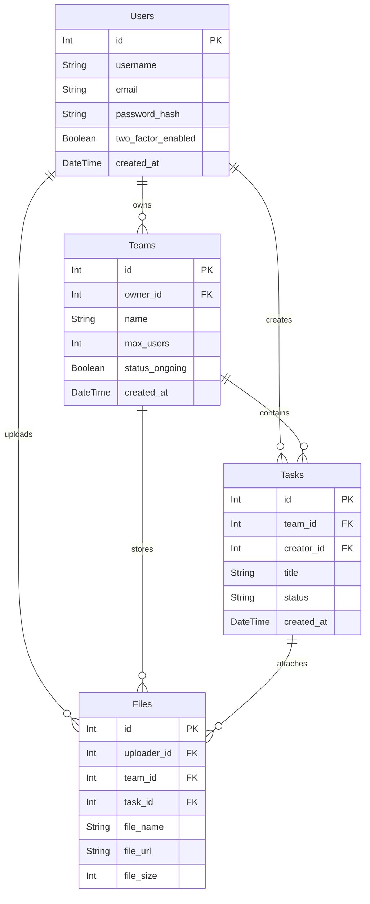

*This project has been created as part of the 42 curriculum by `tialbert`, `nsimao-f`, `diolivei`, `vafernan`.*

# ft_transcendence - Team Task Manager

## Description

The Team Task Manager project consists of developing a collaborative web application focused on team productivity and task management. The application allows multiple users to create and manage teams (organizations), assign and track tasks, communicate in real time, and share files. Each team acts as a workspace where users can collaborate efficiently.

**Primary Goals:**
- Provide a responsive and accessible multi-user web application.
- Support simultaneous users and real-time interactions.
- Implement secure authentication and user management.
- Provide team-based task and file management.
- Maintain a clear backend architecture and database schema.
- Use Docker-based deployment with a single command.

---

## Features List

**User Management:**
- User registration and login.
- Secure password handling.
- User profile pages with avatar, description, friends, teams, and task statistics.
- Profile editing.
- Friend system with friend requests and user search.
- Online/offline friend status.
**Contributors:** `vafernan`, `diolivei`, `tialbert`, `nsimao-f`

**Team Organization:**
- Team creation and management.
- Team detail pages with members, task statistics, and task list.
- Team member roles such as leader and member.
- Team invitations and join requests.
- Team status management.
**Contributors:** `vafernan`, `diolivei`, `tialbert`, `nsimao-f`

**Task Management:**
- Task creation inside teams.
- Task assignment to team members.
- Task status tracking: open, in progress, and closed.
- Task filtering by status and assignee.
- Task search and organization.
- File uploads attached to specific tasks.
**Contributors:** `vafernan`, `diolivei`

**File System:**
- Upload files directly to tasks.
- View files associated with each task.
- Delete uploaded task files when allowed.
**Contributors:** `vafernan`, `diolivei`

**Communication:**
- Real-time team chat.
- Team-specific chat rooms.
- Real-time updates through Socket.IO.
**Contributors:** `tialbert`, `vafernan`

**Notifications:**
- Notification system for important user and team actions.
- Read/unread notification states.
- Notification counters.
- User-friendly error handling for expected frontend errors.
**Contributors:** `vafernan`, `tialbert`, `nsimao-f`

**Access Control:**
- Role-based permissions (admin/member) controlling user actions inside teams.
**Contributors:** `vafernan`, `diolivei`

**Authentication and Security:**
- Email and password authentication.
- Protected backend routes using authentication middleware.
- HTTPS support for browser-to-backend communication.
- Optional 2FA support through email verification codes.
**Contributors:** `vafernan`, `diolivei`

**Legal Pages:**
- Privacy Policy page.
- Terms of Service page.
**Contributors:** `nsimao-f`, `vafernan`

---

## Technical Stack

### Core Technologies

* **Frontend:** React, Vite, TypeScript, Tailwind CSS
* **Backend:** Node.js, Express
* **Database:** PostgreSQL, Prisma ORM
* **Real-time:** Socket.IO
* **DevOps:** Docker, Docker Compose, Make

### Major Technical Choice Justifications

##### 1. Database: PostgreSQL & Prisma ORM
* **Why PostgreSQL?** We chose PostgreSQL because our application relies heavily on structured, relational data with strict data consistency requirements. PostgreSQL handles complex table relationships and transactions flawlessly while offering high reliability.
* **Why Prisma?** Prisma ORM was selected to abstract SQL queries into type-safe database interactions. This drastically accelerated our backend development, prevented runtime query bugs, and made writing database schemas clean and maintainable.

##### 2. Real-time Layer: Socket.IO
* Our application requires live updates for the team chat, friend chat, and active user status indicators. Socket.IO was chosen over raw WebSockets because it offers built-in support for "rooms" (perfect for chat rooms), automatic reconnection handling, and highly reliable message broadcasting out of the box.

##### 3. Frontend: React & Vite
* React's component-based architecture is ideal for building dynamic, interactive user interfaces like a task manager dashboard. We paired it with Vite to ensure near-instant local server startup times and hot-module replacement, keeping our development cycle fast and efficient.

---

## Architecture

The project is organized around a frontend, backend, database, and real-time communication layer.

**Frontend:**
The frontend handles the user interface, routing, forms, and user interactions. It communicates with the backend through REST API calls and listens to real-time events through Socket.IO.

**Backend:**
The backend provides REST API endpoints for authentication, users, teams, tasks, files, notifications, friends, and chat-related logic. It also handles authentication middleware, validation, business rules, and real-time socket events.

**Database:**
The database stores persistent project data using a relational schema managed by Prisma.

**Real-time Layer:**
Socket.IO is used for real-time features, including chat communication, notifications, and live updates like online/offline friend status.

### Database Schema

The database schema is managed through Prisma and includes relations between users, teams, tasks, files, friends, notifications, and chat messages.

* **Users:** `id` (Int), `username` (String), `email` (String), `password_hash` (String), `avatar_url` (String), `bio` (String), `two_factor_enabled` (Boolean), `created_at` (DateTime), `edited_at` (DateTime)
* **Teams:** `id` (Int), `name` (String), `owner_id` (Int), `max_users` (Int), `about` (String), `tags` (String), `status_ongoing` (Boolean), `created_at` (DateTime), `edited_at` (DateTime)
* **TeamUser:** `id` (Int), `user_id` (Int), `team_id` (Int), `joined_at` (DateTime)
* **TeamInvites:** `id` (Int), `team_id` (Int), `user_id` (Int), `status` (String), `created_at` (DateTime)
* **TeamJoinRequests:** `id` (Int), `user_id` (Int), `team_id` (Int), `status` (String), `created_at` (DateTime)
* **Tasks:** `id` (Int), `team_id` (Int), `creator_id` (Int), `title` (String), `description` (String), `status` (String), `created_at` (DateTime), `finished_at` (DateTime)
* **TaskUser:** `id` (Int), `user_id` (Int), `task_id` (Int), `assigned_at` (DateTime)
* **Files:** `id` (Int), `uploader_id` (Int), `team_id` (Int), `task_id` (Int), `file_name` (String), `file_url` (String), `file_type` (String), `file_size` (Int), `created_at` (DateTime)
* **FriendRequests:** `id` (Int), `sender_id` (Int), `receiver_id` (Int), `status` (String), `sent_at` (DateTime), `accepted_at` (DateTime)
* **Friendships:** `id` (Int), `user_id_first` (Int), `user_id_second` (Int), `friends_since` (DateTime)
* **DirectMessages:** `id` (Int), `sender_id` (Int), `receiver_id` (Int), `content` (String), `status_read` (Boolean), `sent_at` (DateTime)
* **TeamMessages:** `id` (Int), `sender_id` (Int), `team_id` (Int), `content` (String), `sent_at` (DateTime)
* **Notifications:** `id` (Int), `user_id_trigger` (Int), `user_id_receiver` (Int), `type` (String), `entity_id` (Int), `entity_type` (String), `content` (String), `status_read` (Boolean), `created_at` (DateTime)

**A simplified visualization of the core database relations:**



---

## Modules

**Completed:** 17 points | **Minimum:** 14 points


> IV.1 Web

**Use a frontend framework (React, Vue, Angular, Svelte, etc.) `(1)`**
- Justification: Essential for the project and subject requirements.
- Implementation: Built using React and Vite, utilizing functional components and React Hooks for state management.
- Team Member(s): `vafernan`, `nsimao-f`

**Use a backend framework (Express, Fastify, NestJS, Django, etc.) `(1)`**
- Justification: Essential for the project and subject requirements.
- Implementation: Implemented using Node.js with Express, structured with controllers and routers.
- Team Member(s): `diolivei`, `tialbert`, `nsimao-f`

**Implement real-time features using WebSockets or similar technology. `(2)`**
-Real-time updates across clients.
-Handle connection/disconnection gracefully.
-Efficient message broadcasting.
- Justification: Crucial for the live chats and real-time user status updates.
- Implementation: Used Socket.IO to create WebSocket connections, handling room-based events for specific teams and broadcasting online/offline statuses.
- Team Member(s): `tialbert`, `nsimao-f`, `vafernan`

**Allow users to interact with other users `(2)`**
The minimum requirements are:
-A basic chat system (send/receive messages between users).
-A profile system (view user information).
-A friends system (add/remove friends, see friends list)
- Justification: Core requirement for a collaborative platform.
- Implementation: Built a complete profile system, a friend-request flow in the database, and real-time direct messaging via Socket.IO.
- Team Member(s): `tialbert`, `vafernan`

**Use an ORM for the database. `(1)`**
- Justification: Reduces raw SQL errors and provides type safety across the backend.
- Implementation: Prisma ORM handles all database migrations, schema generation, and query execution.
- Team Member(s): `nsimao-f`

**A complete notification system for all creation, update, and deletion actions. `(1)`**
- Justification: Keeps users informed about team invites, friend requests, and system events asynchronously.
- Implementation: Stored notifications in PostgreSQL via Prisma, and pushed live alerts to connected clients using Socket.IO.
- Team Member(s): `nsimao-f`, `tialbert`, `vafernan`

**File upload and management system. `(1)`**
-Support multiple file types (images, documents, etc.).
-Client-side and server-side validation (type, size, format).
-Secure file storage with proper access control.
-File preview functionality where applicable.
-Progress indicators for uploads.
-Ability to delete uploaded files
- Justification: Allows teams to share resources and attach documents to tasks.
- Implementation: Handled via `multer` in Express for server-side validation and storage, with secure download routes. Accepts `.pdf` `.png` `.jpeg` `.zip` `.txt` `.docx` as file types.
- Team Member(s): `diolivei`, `vafernan`


> IV.2 Accessibility and Internationalization

**Support for multiple languages (at least 3 languages). `(1)`**
-Implement i18n (internationalization) system.
-At least 3 complete language translations.
-Language switcher in the UI.
-All user-facing text must be translatable.
- Justification: Makes the platform accessible to a wider user base.
- Implementation: Used `react-i18next` to support English, Portuguese, and French, with a UI toggle in profile settings.
- Team Member(s): `vafernan`

**Support for additional browsers. `(1)`**
-Full compatibility with at least 2 additional browsers (Firefox, Safari, Edge, etc.).
-Test and fix all features in each browser.
-Document any browser-specific limitations.
-Consistent UI/UX across all supported browsers.
- Justification: Ensures cross-platform reliability.
- Implementation: No known limitations were identified during testing on Chrome, Firefox, and Safari.
- Team Member(s): `tialbert`, `diolivei`, `vafernan`, `nsimao-f`

> IV.3 User Management

**Standard user management and authentication. `(2)`**
-Users can update their profile information.
-Users can upload an avatar (with a default avatar if none provided).
-Users can add other users as friends and see their online status.
-Users have a profile page displaying their information.
- Justification: Foundational security layer to protect user data and team workspaces.
- Implementation: Implemented secure password hashing with `bcrypt` and JWT-based session tokens. Added a profile customization page and used Socket.IO to display user statuses.
- Team Member(s): `vafernan`, `diolivei`

**Implement remote authentication with OAuth 2.0 (Google, GitHub, 42, etc.). `(1)`**
- Justification: Provides an easier login experience for developers.
- Implementation: Integrated Google Authentication alongside standard email login.
- Team Member(s): `diolivei`, `vafernan`

**An organization system: `(2)`**
-Create, edit, and delete organizations.
-Add users to organizations.
-Remove users from organizations.
-View organizations and allow users to perform specific actions within an organization (minimum: create, read, update).
- Justification: The main operational structure of the application.
- Implementation: Created "Teams" where users have distinct roles (Owner/Member) where actions are gated by backend middleware. Because this feature serves as the core of the application, it required full team collaboration across the entire tech stack (frontend UI, backend API, real-time events, and database relations).
- Team Member(s): `tialbert`, `diolivei`, `vafernan`, `nsimao-f`


**Implement a complete 2FA (Two-Factor Authentication) system for the users. `(1)`**
- Justification: Adds a layer of security for sensitive accounts.
- Implementation: Used Time-based One-Time Passwords / email verification codes upon login if the user has 2FA enabled in their profile.
- Team Member(s): `diolivei`, `vafernan`

### Mandatory Requirements Compliance

This project addresses the required points from the subject:

- Web application with frontend, backend, and database.
- Multi-user support.
- Multiple users can be logged in and active simultaneously.
- Real-time interactions are supported where applicable.
- User registration and login.
- Secure password handling.
- Clear database schema with defined relations.
- Frontend and backend validation for user inputs.
- Docker-based deployment.
- HTTPS for browser-to-backend communication.
- Privacy Policy and Terms of Service pages.
- Clear Git history with contributions from team members.
- README documentation for setup, architecture, roles, and workflow.

---

## Team Information:

The team is composed of four members, with some members taking multiple responsibilities as recommended by the subject.

### Roles

**`diolivei` (Product Owner / Developer):** Defined product vision and priorities, managed backlog, contributed to backend and feature implementation.

**`vafernan` (Project Manager / Developer):** Organized tasks and meetings, tracked progress and deadlines, contributed to frontend and integration.

**`nsimao-f` (Technical Lead / Developer):** Defined architecture and technical choices, ensured code quality, lead backend and system design.

**`tialbert` (DevOps / Developer):** Implemented features, managed Docker and deployment, handled file system and infrastructure.

All team members contributed to development, testing, code review, and documentation.

### Project Management

The team followed a lightweight collaborative workflow:

- Weekly synchronization meetings were held to review progress, discuss blockers, and plan upcoming work.
- Tasks were divided into smaller issues or feature branches.
- Work was distributed between team members.
- Code was reviewed through pull requests before merging.
- Communication was handled through Slack.
- Progress and problems were discussed regularly.
- Important technical decisions were always discussed as a team.

* **Task Tracking:** GitHub Issues
* **Version Control:** Git
* **Communication:** Slack

#### General Workflow:

1. Create an issue in Github Issues.
2. Create a feature branch.
3. Implement the feature or fix.
4. Test locally.
5. Open a pull request.
6. Review and test the PR.
7. Merge after approval by others.


---

## Instructions

### Prerequisites
* Docker (v20.10+)
* Docker Compose (v2.0+)
* Make

### Installation

1. **Clone the repository:**
   ```bash
   git clone <repository_url>
   cd <project_name>
   ```

2. **Configure environment variables:**

   - Run the automated make rule to generate the required `.env` files and directories with default `dummy` values tailored for local evaluation:
   ```bash
   make env
   ```

3. **Start the application:**
   ```bash
   make all
   ```

4. **Access the application:**

   ```txt
   https://localhost
   ```

### Relevant Development Commands


```bash
make all
```
Build and start all services while preserving the database.

```bash
make build
```
Create the local database storage folder and build all Docker containers.

```bash
make up
```
Create and start all containers in detached mode.

```bash
make down
```
Stop and remove containers and networks while keeping persistent data.

```bash
make stop
```
Stop the running containers without removing them.

```bash
make start
```
Start previously stopped containers.

```bash
make clean
```
Stop and remove containers, networks, and Docker volumes.

```bash
make fclean
```
Dangerous full cleanup. Removes project data under ${HOME}/data, all Docker containers, all Docker images, and prunes Docker volumes.

```bash
make re
```
Clean rebuild. Removes containers and volumes, rebuilds the project, and starts it again.

```bash
make frontRebuild
```
Rebuild only the frontend container without cache and restart services.

```bash
make backRebuild
```
Rebuild only the backend container without cache and restart services.

```bash
make dataRebuild
```
Rebuild only the PostgreSQL container without cache and restart services.

```bash
make studio
```
Start Prisma Studio inside the backend container on port 5555.

```bash
make migrate
```
Run Prisma migrations inside the backend container.

```bash
make seed
```
Populate the database with mock data.

---

## Resources

**Documentation & References:**
* [React Documentation](https://react.dev/learn)
* [Tailwind CSS Docs](https://tailwindcss.com/docs)
* [Prisma Documentation](https://www.prisma.io/docs/)
* [Socket.IO Documentation](https://socket.io/docs/v4/)

**AI Usage Disclosure:**
Artificial Intelligence tools were utilized primarily to assist with creating testing scripts, generating mock data, and streamlining repetitive DevOps tasks. All core application logic, system architecture, and feature implementations were authored strictly by the team members.

---

## Individual Contributions

#### `vafernan` (Project Manager / Developer)
- Lead the Frontend Framework implementation using React and Vite.
- Implemented the UI/UX for User Management & Authentication, including the 2FA and Google OAuth 2.0 flows.
- Integrated the Real-time WebSockets on the client side, handling UI updates for the Chat, Notifications, and Friend System.
- Developed the i18n (Internationalization) module, enabling multi-language support (English, Portuguese, French).
- Assisted in frontend integration for the Organization System and File Upload module.
- **Challenges & Resolutions**: Managing complex real-time state in React. When receiving high-frequency Socket.IO events (like chat messages or online status changes), the app initially suffered from unnecessary re-renders. This was overcome by carefully optimizing React Hooks (useEffect, useMemo) and state management to ensure smooth UI performance.

#### `nsimao-f` (Technical Lead / Developer)
- Designed and implemented the complete database layer from scratch using Prisma ORM, including initial mockups, schema definitions, and migration logic.
- Architected the core Backend Framework using Node.js and Express.
- Developed the core backend REST API endpoints for Teams, Friends, and the Notification system.
- Architected the base logic for the Real-time WebSocket Notifications.
- Stepped in to support frontend development with UI/UX glowup.
- **Challenges & Resolutions**: Designing a highly relational database schema. Mapping the complex relationships between Users, Teams, Roles, and Tasks required strict data integrity. This was overcome by leveraging Prisma's relational models and executing strict cascading rules to prevent orphaned records when teams or users were deleted.

#### `diolivei` (Product Owner / Developer)
- Developed backend REST APIs for Standard User Management & Authentication, including secure password hashing and JWT sessions.
- Implemented the backend logic for OAuth 2.0 (Google) and the 2FA (Two-Factor Authentication) system.
- Built the File Upload and Management backend, incorporating server-side validation using multer.
- Contributed to the backend architecture and Organization System logic.
- **Challenges & Resolutions**: Ensuring secure and reliable file handling. Allowing users to upload files to tasks introduced security risks regarding file types and sizes. This was overcome by writing strict middleware using multer to validate MIME types and enforce file-size limits before the files ever reached the storage layer.

#### `tialbert` (DevOps / Developer)
- Architected the complete DevOps environment, configuring Docker and Docker Compose to successfully containerize and integrate the frontend, backend, database.
- Implemented backend logic for Real-time Chat Features and WebSocket event handling.
- Built the core server logic for the Chat System, enabling direct messaging and team-specific rooms.
- Ensured cross-browser compatibility and testing across the application.
- **Challenges & Resolutions**: Isolating real-time communication between different organizations. It was critical that chat messages and task updates in one team did not leak to another. This was overcome by effectively utilizing Socket.IO's "rooms" feature, ensuring clients only subscribed to and received broadcasts for the specific teams they were authorized to view.
